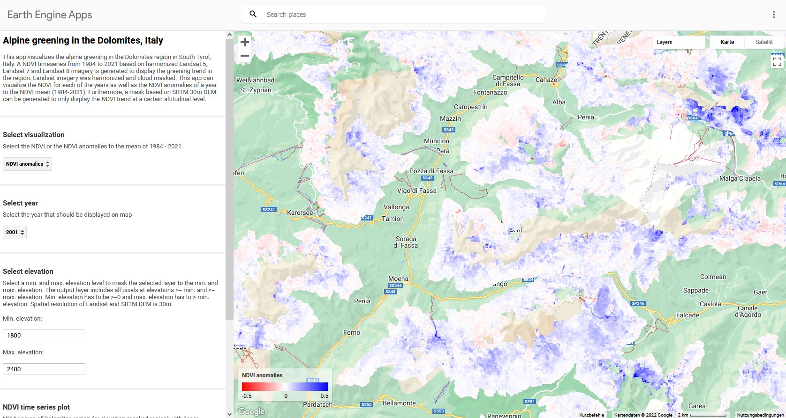

# Alpine greening in the Dolomite Alps, Italy

This repo contains the source code for an Google Earth Engine App that displays the Landsat NDVI time series from 1984-2021 in the Dolomite Alps, Italy.
The app allows the following:
- Display annual NDVI or NDVI anomalies to the long-term NDVI mean (1984-2021)
- Dynamically mask layer by defining altitudinal levels.
- Generate time series and trend plot for selected layers.

The [pre-processing script](https://github.com/moritzroesch/Alpine-Greening/blob/main/dolomiten_NDVItimeseries.js) uses Landsat 5, Landsat 7 and Landsat 8 imagery. The data is radiometrically harmonized, cloud and snow masked before annual NDVI mosaics are generated.

Access the app [here](https://moritzroesch.users.earthengine.app/view/alpine-greening-dolomites).

